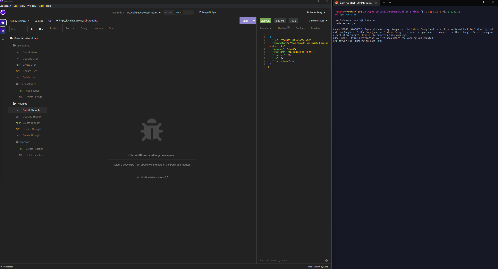
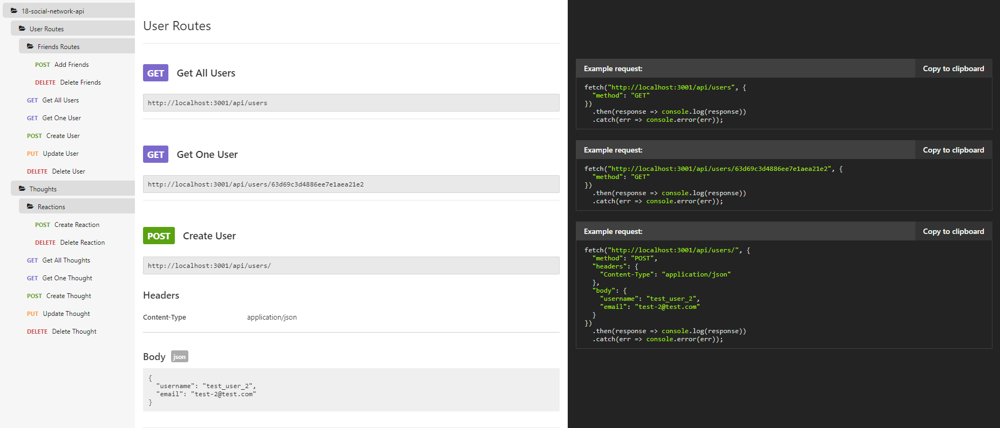
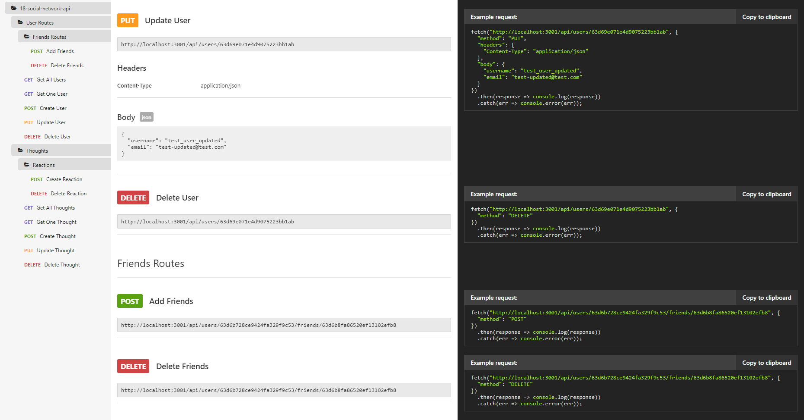
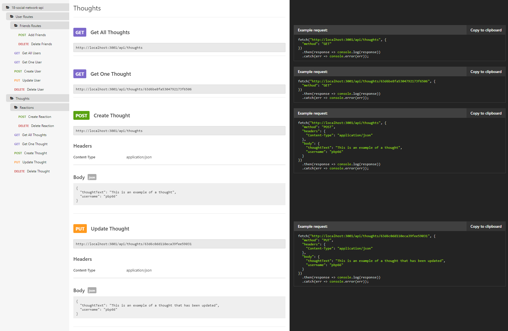
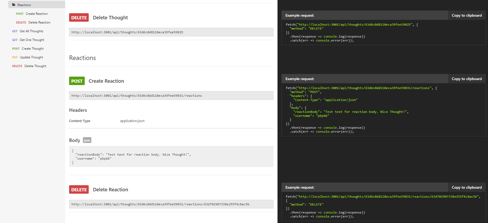

# Social-network-api

## Description

Simple social network api with the capability to create short thoughts and reactions to the thoughts. Thoughts can be created, updated, deleted, and retrieved for viewing purposes. Users can be created, updated, and deleted as well. Functionality is provided to add and delete friends.

API Server is built using [express.js](https://expressjs.com/) with [Mongo DB](https://www.mongodb.com/) as the backend. [Mongoose](https://mongoosejs.com/docs/) is used as the ORM to interface with MongoDB. [Luxon](https://moment.github.io/luxon/#/?id=luxon) is used for formatting date and time stamps in the JSON response.

User Story

```
AS A social media startup
I WANT an API for my social network that uses a NoSQL database
SO THAT my website can handle large amounts of unstructured data
```

Acceptance Criteria

```
GIVEN a social network API
WHEN I enter the command to invoke the application
THEN my server is started and the Mongoose models are synced to the MongoDB database
WHEN I open API GET routes in Insomnia for users and thoughts
THEN the data for each of these routes is displayed in a formatted JSON
WHEN I test API POST, PUT, and DELETE routes in Insomnia
THEN I am able to successfully create, update, and delete users and thoughts in my database
WHEN I test API POST and DELETE routes in Insomnia
THEN I am able to successfully create and delete reactions to thoughts and add and remove friends to a user’s friend list
```

## Table of Contents

- [Social-network-api](#social-network-api)
  - [Description](#description)
  - [Table of Contents](#table-of-contents)
  - [Installation](#installation)
  - [Usage](#usage)
  - [License](#license)
  - [How to Contribute](#how-to-contribute)
  - [Tests](#tests)
  - [Questions](#questions)

## Installation

Git Clone this repository onto your local machine. Navigate to the downloaded project location. Open a command-line terminal in the same directory and run `npm install`. If you do not have nodejs and npm installed, you must install those first before running `npm install`. After npm install completes, you are ready to run the program.

## Usage

To start the API server, type `npm run start` or `node server.js`. Upon successful startup, this message will appear indicating which port is being utilized on [localhost](https://localhost/3001)` API server for running on port 3001!`. To use the API, all requests follow a url structure of `https:/localhost/3001/api/users or https:/localhost/3001/api/thoughts`. The full API documentation is provided via the video walkthrough or the static screenshots below.

View this video walkthrough to see the API route in action:
[](https://drive.google.com/file/d/1NK0sIh4GxKipPgGycMGyYgrKQWzpKnKA/view)
Or view on [youtube](https://youtu.be/qykdhZ04bJA).

Static screenshots of the api documentation generated by Insomnia:






## License


MIT

Copyright (c) 2023

Permission is hereby granted, free of charge, to any person obtaining a copy of this software and associated documentation files (the "Software"), to deal in the Software without restriction, including without limitation the rights to use, copy, modify, merge, publish, distribute, sublicense, and/or sell copies of the Software, and to permit persons to whom the Software is furnished to do so, subject to the following conditions:

The above copyright notice and this permission notice shall be included in all copies or substantial portions of the Software.

THE SOFTWARE IS PROVIDED "AS IS", WITHOUT WARRANTY OF ANY KIND, EXPRESS OR IMPLIED, INCLUDING BUT NOT LIMITED TO THE WARRANTIES OF MERCHANTABILITY, FITNESS FOR A PARTICULAR PURPOSE AND NONINFRINGEMENT. IN NO EVENT SHALL THE AUTHORS OR COPYRIGHT HOLDERS BE LIABLE FOR ANY CLAIM, DAMAGES OR OTHER LIABILITY, WHETHER IN AN ACTION OF CONTRACT, TORT OR OTHERWISE, ARISING FROM, OUT OF OR IN CONNECTION WITH THE SOFTWARE OR THE USE OR OTHER DEALINGS IN THE SOFTWARE.

## How to Contribute

Before contributing, be sure to read the GitHub [Code of Conduct](https://github.com/github/docs/blob/main/CODE_OF_CONDUCT.md). If you have an issue, search all open issues to see if one matches the description of your issue. If not, proceed to create one providing details on the issue, errors, OS, options provided, installed node packages, etc. Issues are not assigned to anyone by the repository team. To select an issue to work on, open a pull request and generate a new branch labeled as the issue. Add your name as a contributor to the issue in question. When you make the desired changes and fixes, push all changes to your branch on the repository and submit. The repository team will review the changes. If acceptable, we will merge the changes to main and we will notify you of a successful merge or any necessary changes before a merge can take place.

## Tests

No Tests Provided

## Questions

Repo owner: [pbp66](https://github.com/pbp66).
For any questions, you may contact pbp66 via email: pbp66.coding@gmail.com. Please format your email using the following template:

-   Subject: Repository - Question/Issue
-   Body: Summarize the issue with a brief description for the first paragraph. Additional paragraphs can be used for a long description, if needed. Include any errors when using this project
-   Signature: Please leave an email address so that any updates are sent get back to you.
